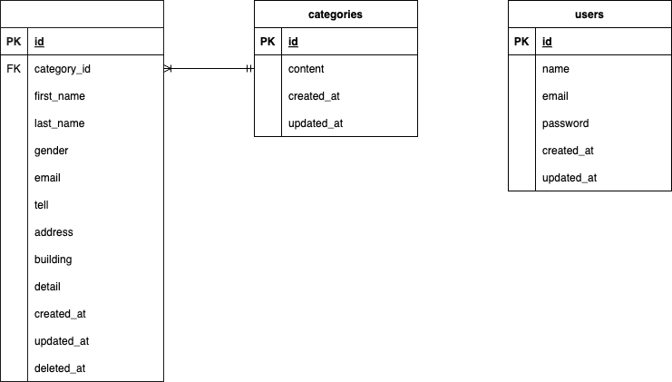

# Fashionably Late(お問い合わせフォーム)

## 環境構築

#### Dockerビルド
  ```
  git clone リンク
  ```
  ```
  docker-compose up -d --build
  ```
*MySQLはOSによって起動しない場合があるので、それぞれのPCに合わせてdocker-compose.ymlファイルを編集してください
  <br>
  <br>
#### Laravel環境構築
  1. PHPコンテナへ入る
  ```
  docker-compose exec php bash
  ```
  <br>

  2. composerをインストール
  ```
  composer install
  ```
  <br>

  3. .env.exampleファイルをコピーして.envファイルを作成し、環境変数を変更する
  ```
  cp .env.example .env
  ```
  <br>

  4. アプリケーションキーを取得
  ```
  php artisan key:generate
  ```
  <br>

  5. テーブル作成
  ```
  php artisan migrate
  ```
  <br>

  6. ダミーデータ作成
  ```
  php artisan db:seed
  ```
  <br>

## 使用技術
  * php 8.3.8
  * Laravel 8.83.8
  * MySQL 8.0.26
<br>

## ER図
  

<br>

## URL
  * 開発環境  
      * 問い合わせフォーム <http://localhost/>   
      * 管理者ログインページ <http://localhost/login>
  * phpMyAdmin <http://localhost:8080>
